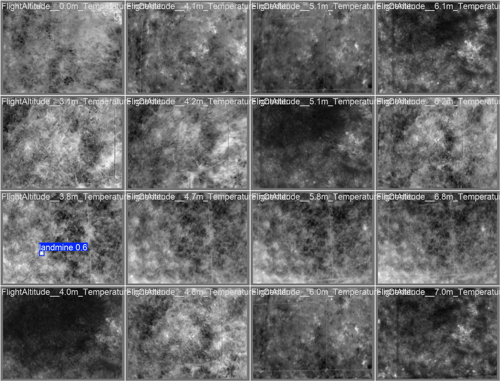
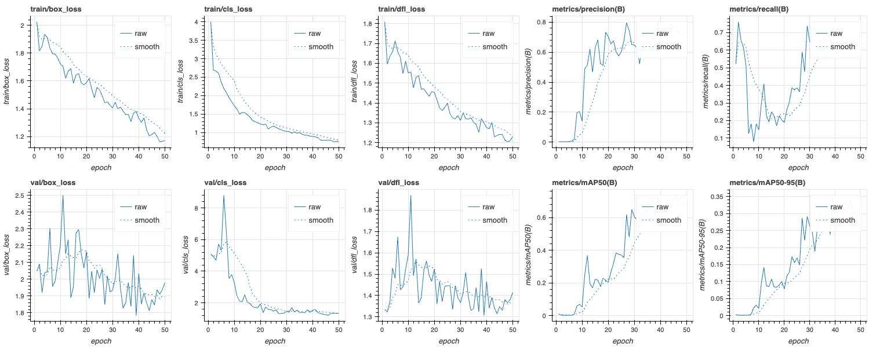
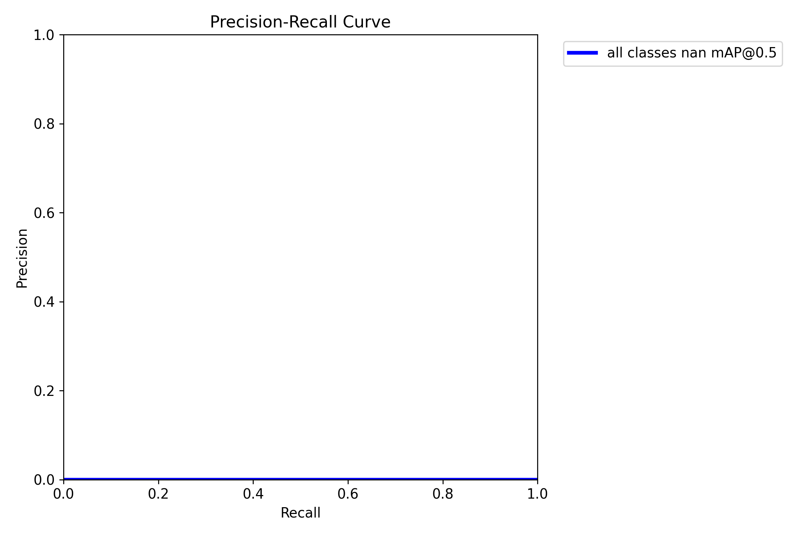

# Landmine Detection from Drone Thermal Imagery (YOLOv11)

Antipersonnel landmine detector trained on UAV **thermal (RJPEG) imagery** using YOLO11n, detecting buried "legbreaker" mines at 0–10 cm depths.



## Pipeline

1. **Data curation** — filtered a raw corpus of 2,700 multisource images (JPEG/RJPEG/TIFF, mine and free-zone scenes) down to 465 valid RJPEG frames containing buried mines; stratified by burial depth so 0, 1, 5 and 10 cm are all represented, then split 314 train / 80 val / 71 test in YOLO format.
2. **Training** — YOLO11n fine-tuned for 50 epochs at 640px on the Apple MPS backend.
3. **Evaluation** — PR curves and confusion matrix, qualitative inference, and **negative-image validation** against mine-free scenes to measure the false-alarm rate.

## Results

Per-epoch validation metrics, from `training/results.csv`:

| Metric | Final epoch (50) | Best epoch (46) |
|---|---|---|
| mAP@50 | 0.675 | **0.735** |
| mAP@50–95 | 0.290 | 0.337 |
| Precision | 0.709 | 0.771 |
| Recall | 0.664 | 0.659 |

At a fixed 0.28 confidence threshold on the 71-instance test split, the confusion matrix gives 64 detected, 7 missed and 7 background regions wrongly flagged — precision and recall both around 0.90 at that single operating point, with peak F1 0.87.

| | |
|---|---|
|  |  |

### The number that matters is the one on empty ground

A detector for this job is judged on what it does where there is nothing to find. Running inference over 53 mine-free "free zone" images produced detections in 8 of them — a **15.1% false-alarm rate** at a 0.25 confidence threshold.

That is the result that would stop this being deployed. A demining operator who gets a spurious alert on one scene in seven stops trusting the tool, and an ignored detector is worse than no detector. Fixing it means more free-zone scenes in training across different terrain and shadow conditions, not a better backbone.

> **Note on the report's headline figure.** `docs/` states mAP@0.5 = 90.4% in its conclusion. That figure is not supported by the training log in this repository and appears to come from reading the confusion matrix (64 of 71 detected ≈ 90%) as though it were mAP — those are different quantities, one being recall at a single threshold. The table above is what the log actually recorded. The report is left as submitted; this note records the discrepancy.

## Repo contents

| Path | Description |
|---|---|
| `notebooks/landmine.ipynb` | Full pipeline: data prep → training → evaluation |
| `landmine.yaml` | YOLO dataset config (point at your local dataset copy) |
| `training/results.csv` | Per-epoch training log — the source for the table above |
| `docs/ELEC3612_Project_2_Report.pdf` | 14-page report with full methodology |

**Dataset:** UAV thermal imagery of buried landmines, from a published *Data in Brief* dataset (multi-flight, multi-altitude, labelled by mine location and burial depth). Not redistributed here — see the report for the citation and source.

## Run it

```bash
pip install -r requirements.txt
# download the dataset (see docs/report), update paths in landmine.yaml, then:
jupyter notebook notebooks/landmine.ipynb
```

## Limitations

- 465 images from one controlled test grid. Soil type, vegetation and weather barely vary, and thermal signatures move with ambient temperature and moisture — so these numbers should not be expected to hold in a different climate.
- Mines at 10 cm occupy a few pixels at altitude. Recall is depth-dependent and the dataset is too small to quantify that properly per depth band.
- The 15.1% false-alarm rate is measured on 53 images. It is an indication, not a precise rate.
- Nothing here is field-validated, and nothing here should be used to decide where a person walks.

## Context

Pattern Recognition & Machine Intelligence project (ELEC3612, University of Sydney, 2025 — course mark: 89 HD). Solo work.
